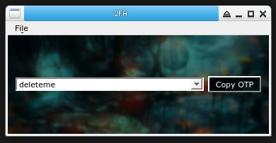

# 2fa-qt

Frontend for `rsc/2fa` command line 2FA OTP manager



### dependencies
```
GOBIN=$PWD go get -v -u github.com/rsc/2fa
sudo mv 2fa /usr/local/bin/

```

### building

Fetch source
```
git clone https://github.com/aerth/2fa-qt
cd 2fa-qt
```

Then compile

```
mkdir build
cd build
qmake ..
make -j2
sudo mv 2fa-qt /usr/local/bin/
```
